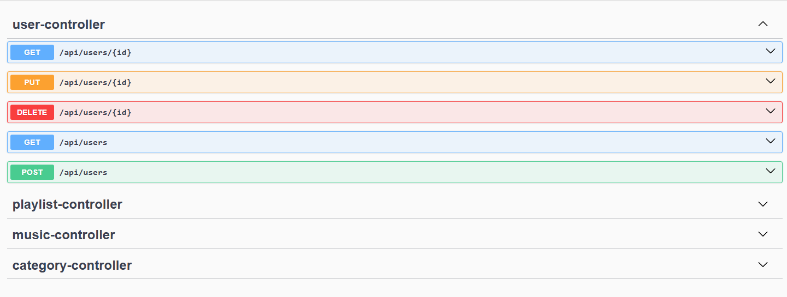

<h1 align="center"> DZ7API </h1>


<h2>:label: Descrição do projeto</h2>

O DZ7API é um projeto de API desenvolvido para a Situação de Aprendizagem (SA) da unidade curricular de Programação Orientada a Objeto (POO).

O objetivo da API em seu principal propósito é realizar a indicação de músicas com base na temperatura atual da localização do usuário, permitindo também a visualização de informações das músicas e artistas e criação de playlists.

<h2>:pushpin: Estado atual</h2>

Atualmente, o projeta conta com:

**CRUD:** Criação, visualização, alteração e exclusão de dados;<br>
**Banco de dados (MySQL):** Registro dos dados em banco; 

<h2>:memo: Requisitos</h2>

> [!IMPORTANT]
> Certifique-se de seguir todos os passos para o funcionamento correto do projeto!
<br>

**1. Java 21** <br>
Este projeto utiliza o Java 21 (que não possui mais distribuição pelo OpenJDK), portanto certifique-se de possuir essa versão ou uma **versão superior.**
Para verificar sua versão do Java, abra seu prompt de comando (CMD) e utilize o seguinte comando:

```bash
java --version
```

Este comando deve retornar a versão do Java instalada em seu compuador, caso o Java não seja encontrado, faça o download através do link abaixo:

:cd: [Java 23](https://jdk.java.net/23/) <br>
:memo: [Tutorial de instalação](https://www.devmedia.com.br/instalacao-e-configuracao-do-pacote-java-jdk/23749)<br><br>

**2. Maven 3.9+**<br>
Para gerenciar as dependências utilizadas, este projeto utiliza o Maven na versão 3.9. Caso já possua a instalação, verique a versão utilizando o comando:

```bash
mvn --version
```

Caso não possuir o Maven instalado, faça o download através do link abaixo:

:cd: [Maven 3.9.9](https://maven.apache.org/download.cgi) <br>
:memo: [Documentação](https://maven.apache.org/install.html)<br><br>

**3. MySQL 8.0.x**<br>
Para realizar a gravação e gerenciamento dos dados, foi utilizado o MySQL Workbench Community. Caso já possua uma instalçao, verique a versão utilizando o comando:

```bash
mysql --version
```

Caso não possuir o MySQL instalado, faça o download através do link abaixo:

:cd: [MySQL](https://www.mysql.com/downloads/)<br>
:memo: [Tutorial de instalação](https://www.alura.com.br/artigos/mysql-do-download-e-instalacao-ate-sua-primeira-tabela)<br><br>

<h2>:arrow_down: Clonando o projeto</h2>

Para iniciar, você necesita possuir uma IDE para executar esse projeto, caso não possua, realize a instalação do Visual Studio Code (VSCode) pelo link abaixo:

:cd: [Visual Studio Code](https://code.visualstudio.com/Download)<br>
:memo: [Tutorial de instalação](https://www.devmedia.com.br/guia-completo-do-visual-studio-code/43827)<br><br>

Após concluir a instalação, siga os seguintes passos:

**1. Crie uma pasta em sua máquina que receberá o clone do projeto;**<br>
**2. Abra essa pasta com o Visual Studio Code;**<br>
**3. Execute o seguinte comando:**<br>

```bash
git clone https://github.com/dokasmn/dz7Api.git
```

Agora você possui uma cópia do projeto para testar! <br>

<h2>:gear: Configurações</h2>
Para começar, você deve configurar o acesso ao banco de dados pela API, lembre-se de estar no diretótio do projeto! Se não tiver certeza que está na pasta correta, execute o comando:
<br><br>

```bash
cd dz7api
```

Em seguida, execute o seguinte comando para configurar o acesso ao seu banco de dados:<BR>

>[!WARNING]
>Troque a palavra "exemplo" pelo username e senha que você escolheu no momento de configurar seu acesso no MySQL Workbench.

```bash
set SPRING_DATASOURCE_USERNAME=exemplo
```

Pressione a tecla enter e em seguida execute a configuração para a senha:

```bash
set SPRING_DATASOURCE_PASSWORD=exemplo
```

Após o passo acima, realize a instalação das extensões do Java no Visual Studio Code, para isso, localize o menu de extensões na barra lateral esquerda do VSCode ou use o atalho **Ctrl+Shift+X** para abri-lo.
Pesquise por "Java" e realize a instalação do "Extension Pack for Java", essa extensão facilita a execução e outras funções dentro do VSCode.

<h2>:rocket: Criando o banco de dados e iniciando projeto </h2>

Para iniciar, crie um banco de dados chamado "dz7api" no seu MySQL Workbench:

```bash
CREATE DATABASE dz7api;
```

Depois, voltando ao VSCode, acesse a pasta "src", em seguida a pasta "java" e abra o arquivo "Dz7ApiApplication.java" e execute o mesmo, ou execute pelo terminal com o comando:

```bash
mvn spring:boot run
```

Se o projeto for executado com sucesso, você verá uma mensagem de retorno indicando que a build foi bem sucedida!

<h2>:earth_americas: Populando o banco de dados</h2>

Para que os testes já possam ser realizados sem a necessidade de cadastrar vários dados, separamos um arquivo com o nome "presets.sql". Esse arquivo pode ser encontrado na pasta raíz do projeto.<br><br>
Abra o MySQL Workbench com o banco de dados já criado e abra o arquivo "presets.sql", em seguida ececute as queries individualmente para evitar erros.

<h2>:spider_web:Acessando os endpoints</h2>

Por fim, acesse os endpoints através da URL do Swagger para testar os endpoints. Por padrão, o Swagger hospeda sua UI no localhost de sua máquina, através do seguinte link:

```bash
http://localhost:8080/swagger-ui/index.html
```

**Exemplo da interface do Swagger:**

<br>

Acessando cada um dos métodos, você poderá testar todos os endpoints para todos os controllers! <br>

<h2>:computer:Responsáveis pelo projeto</h2>

[Eliel Schubert](https://github.com/elielschubert/) e [Cauan Moreira](https://github.com/dokasmn/).


